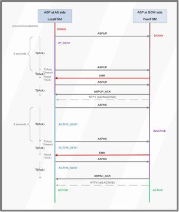
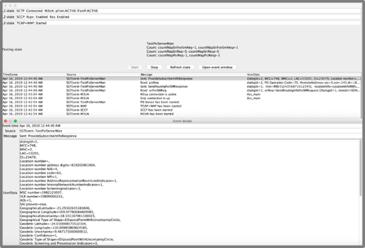
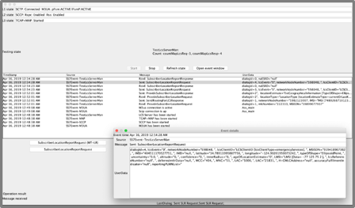

# Naikeri jSS7

> Naikeri jSS7 is cloned from [RestComm jSS7](https://github.com/RestComm/jss7) from which we have added a set of improvements and new features listed in a later section of this file.


## Introduction

Open Source Java SS7 stack allows applications to communicate with legacy SS7 communications network nodes.

Naikeri jSS7 provides implementation of SS7 stack layers `MTP2`, `MTP3`, `ISUP`, `SCCP`, `TCAP`, `CAMEL (Phase I, Phase II, Phase III and Phase IV)` and
`MAP`. It also has in-built support for `SIGTRAN (SCTP/M3UA)` over IP and strictly adheres to the standards and specifications defined by the International Telecommunications Union (ITU), the 3rd Generation Partnership Project (3GPP), and the Internet Engineering Task Force (IETF). The
platform offers a flexible API set for developers that hides underlying Telecom infrastructure and thus making it easier to implement SS7 services as well as
migrating their applications over Time Division Multiplexing (TDM) equipments to SS7 over IP (SIGTRAN). {this-platform}  {this-application}  is based on an easily scalable and configurable load-balancing architecture.

Naikeri jSS7 supports TDM hardware offered by major vendors in the market, namely Intel family boards (Dialogic) and  Zaptel/Dahdi (Digium, Sangoma). For production purposes, Dialogic boards with MTP2 and MTP3 on-board are the only ones tested and therefore recommended.

If you intend to use `SIGTRAN` only (recommended), you can install Naikeri jSS7 on any Operating System that supports Java and _Stream Control Transmission Protocol_ (SCTP). Any flavour of Linux OS supports SCTP natively or through an easy installation of Linux Kernel SCTP libraries/dev tools.

Naikeri jSS7 makes JAIN-SLEE TCAP, MAP, CAP and ISUP Resource Adaptors (RA) development possible, which enable developers to build SS7 applications with ease. They would only require an understanding of JAIN-SLEE Resource Adaptors and can focus on building applications quickly and efficiently rather than worrying about the underlying SS7 stack. If you wish to use JAIN-SLEE Resource Adaptors, the Command Line Interface (CLI - Shell Management tool) or the Graphic User Interface (GUI) for run-time configuration, then you must have either JBoss or WildFly Application Server installed and running. Anyway, if you do not wish to use the Resource Adaptors, then Naikeri jSS7 can work as a standalone library.

The Open Source Software gives you the flexibility to understand the readily available source code and customise the product for your Enterprise needs.


## Build Naikeri jSS7

### Pre-Requisites for Building from Source

* `JDK 11`: the stack builds and runs on Java 11. This is the JDK used by CI (`jdk-11`).
* `Git Client`: Instructions for using GIT, including install, can be found at http://git-scm.com/book
* `Maven 3.9.X`: Instructions for using Maven, including install, can be found at http://maven.apache.org/. CI builds with `maven-3.9.12`.
* `Ant 1.9.X` or later: Instructions for using Ant, including install, can be found at http://ant.apache.org
* `jmxtools:jar`:  This library is required to build the Simulator source code. The library `com.sun.jdmk:jmxtools:jar:1.2.1` must be downloaded manually and placed in your maven repository. Instructions are provided below.


Here is the list of commands you need to run for building Naikeri jSS7 from the source:

1. Clone jSS7 Repo : `git clone https://github.com/FerUy/naikeri-jss7`
2. Download Dialogic dependencies from Dialogic website. This is required to build the hardware part of jSS7 to have support for Dialogic boards in case you can't use SIGTRAN directly : `wget https://www.dialogic.com/files/DSI/developmentpackages/linux/dpklnx.Z`
3. Unpack the contents of the Dialogic SS7 dependencies : `tar --no-same-owner -zxvf dpklnx.Z`
4. Install the Dialogic SS7 Java Dependency in your local maven repository : `mvn install:install-file -DgroupId=com.vendor.dialogic -DartifactId=gctapi -Dversion=6.7.1 -Dpackaging=jar -Dfile=./JAVA/gctApi.jar`
5. Download Sun JMX tools dependency used by the jSS7 simulator : `wget http://www.datanucleus.org/downloads/maven2/com/sun/jdmk/jmxtools/1.2.1/jmxtools-1.2.1.jar`
6. Install the Sun JMX Tools Dependency in your local maven repository : `mvn install:install-file -DgroupId=com.sun.jdmk -DartifactId=jmxtools -Dversion=1.2.1 -Dpackaging=jar -Dfile=jmxtools-1.2.1.jar`
7. Build jSS7 with maven : `mvn clean install -Dmaven.test.skip=true`
8. Enjoy the best SS7 Open Source Stack out there ;) !

Note: For deploying of binaries into a local JBoss AS you need to configure a JBOSS_HOME environmental variable to a JBOSS folder and run following mvn commands:

1. `mvn clean install -Pdeploy-module-jboss5 -Dmaven.test.skip=true` (for JBoss 5.1 server)
2. `mvn clean install -Pdeploy-module-wildfly -Dmaven.test.skip=true` (for WildFly 10 server)


### A Note on Versioning

The project version in `pom.xml` is `9.0.0-SNAPSHOT`. CI stamps the build number onto the
major version, so released artifacts are published as `9.0.0-<build>` (for example,
`9.0.0-1557`). When a consumer pins a jSS7 dependency it pins the stamped version, not the
`-SNAPSHOT` one.


## Generate WildFly Version

To generate a WildFly version of Naikeri jSS7 use the following steps.

- Download and unpack `WildFly 24.0.1.Final`.

  Optionally, install Naikeri/RestComm SLEE into it beforehand: the WildFly build step
  detects the SLEE container automatically and wires `org.restcomm.ss7.modules` into it only
  if it is present. The SLEE is required only if you intend to use the JAIN-SLEE Resource
  Adaptors.

- Build the release with ant. The `release.version` and `sctp.version` defaults in
  `release/build.xml` are already current, so no `-D` overrides are needed:
  ```bash
  cd release
  ant -f build.xml
  ```
  This produces `Naikeri-jSS7-9.0.0-SNAPSHOT.zip`. Naikeri SCTP is downloaded from
  Artifactory during the build; it does not need to be built separately.

  To build against different versions, override the defaults:
  ```bash
  ant -f build.xml -Drelease.version=9.0.0-SNAPSHOT -Dsctp.version=2.1.0-39
  ```

- Unzip the resulting file and run the command below to install it into your WildFly:
  ```sh
  cd Naikeri-jSS7-9.0.0-SNAPSHOT/ss7-wildfly
  ant -f build.xml -Djboss.home=/path/to/wildfly-24.0.1.Final
  ```
- NOTE: `jboss.home` defaults to the `JBOSS_HOME` environment variable, so if that is
  exported you may omit the `-Djboss.home` argument.


## Build Docker

A `Dockerfile` is provided in the root of this repository. It expects the WildFly bundle
produced by the `Naikeri-jSS7-WildFly` Jenkins job — `Naikeri-jSS7-WildFly-<version>.zip`,
which unpacks to `Naikeri-jSS7-WildFly-<version>/` and already contains the WildFly install
with jSS7 deployed into it — to be unpacked next to the `Dockerfile`. Adjust the version in
the `COPY` line to match the bundle you are building from.

Note this is the WildFly bundle, not the `Naikeri-jSS7-<version>.zip` produced by
`release/build.xml`; the latter contains the stack but no application server.

```dockerfile
FROM amazoncorretto:11-alpine

LABEL maintainer="Fernando Mendioroz <fernando.mendioroz@gmail.com>"

# install dependencies (bash is required by WildFly's standalone.sh)
RUN apk add --no-cache bash net-tools lksctp-tools supervisor lksctp-tools-dev

# create and set workspace
RUN mkdir -p /opt/naikeri/jss7
WORKDIR /opt/naikeri/jss7

# produced by the Naikeri-jSS7-WildFly Jenkins job; version subject to change
COPY Naikeri-jSS7-WildFly-9.0.0-1557/. .

RUN chmod +x wildfly-24.0.1.Final/bin/standalone.sh

# run application
ENTRYPOINT ["/opt/naikeri/jss7/wildfly-24.0.1.Final/bin/standalone.sh"]
CMD ["-b", "0.0.0.0"]
```


## Changelog by September 2021

* Upgraded Naikeri-jSS7 to run over JDK 11.

* JMX integration with WildFly.

* Integration of native automatic configurable monitoring routines, allowing automatic restart feature when ASP is not in Active state, while the AS is Active, without depending on external library integration. It is included now as a sniffer library.

* Native integration with Prometheus without dependencies of external libraries.

* A metric endpoint consumed by Prometheus providing the following monitoring and key parameter indicators:
  - SCTP association status
  - M3UA AS status
  - M3UA ASP status
  - M3UA Tx messages number
  - M3UA Rx messages number
  - MTP3 payload

* Restored features from the discontinued Restcomm community version:
  - Restored Operation and Maintenance libraries and Web GUI.
  - SCCP Routing by GT.
  - Statistic libraries.

* Kubernetes template to enable importing RestComm jSS7 Docker images to Kubernetes clusters. It includes a supervisor configured to start the RestComm jSS7 instance automatically.

* Implemented EUtranCgi (**EUTRAN CGI**), RAId (**ROUTEING AREA ID**) and TAId (**TRACKING AREA ID**) in map-api/impl within mobility/subscriberInformation
  packages.

* Implemented `polygon` type of shape for additional location estimate for both **MAP PSL** (Provide Subscriber Location) and **MAP SLR**
  (Subscriber Location Report) operations.

* Upgraded RequestedInfo/Impl to support remaining parameters as per release 15.5.0 of 3GPP TS 29.002 (MAP specification), including locationInformationEPS-Supported.

* Added `periodicLDR` option for DeferredLocationEventType.

* Implementation of `notificationVerificationOnly` option to Location Estimate Type as per release 15.5.0 of 3GPP TS 29.002 (MAP specification).

* Implemented **M3UA ERR** handling in M3UA Finite State Machine (see bug fixing section for further details), which solved a bug by which whenever an
  M3UA ERR was received in reply to ASP ACTIVE (ASPAC), the ASP state kept in INACTIVE state forever unless a manual stop/start via CLI or manual restart of the service was carried out. As portrayed in the call flow example below, fixes included successful all the following possibilities:
  - ASPUP resending upon ASPUP timeout
  - ASPUP resending upon any MM3UA ERR occurrence
  - ASPAC resending upon ASPAC timeout
  - ASPAC resending upon any M3UA ERR occurrence

  


* Implementation of `M3ua_ManagementMessageHandler.xml` configuration file for **M3UA ERR** handling, including retry policy on specific M3UA ERR messages, including
  - on/off flag for
    whether there should be retransmission for ASPUP, ASPAC in case of specific M3UA ERR such as `Refused - Management Blocking` `Invalid Routing Context`, etc.
  - how many times such a retransmission should take place before giving up. An example of such configuration is shown next:

```
<?xml version="1.0" encoding="UTF-8" ?>
<errorManagement>
   <error name="refusedManagementBlocking" code="13" retry="-1" />
   <error name="invalidRoutingContext" code="25" retry="1"/>
   <error name="destinationStatusUnknown" code="20" retry="10"/>
</errorManagement>
```

* `M3ua_ManagementMessageHandler.xml` management via CLI and GUI.

* Several enhancements and additions in jSS7 simulator, namely:
  - Improved ATI_TEST_SERVER testing task with random answers for all types of location responses with all possible parameters, including error responses
    for specific MSISDNs. Some parameters include binary data taken from real networks (obtained from RestComm-GMLC), as well as some others matching
    external cell databases such as the one from OpenCellId project.
  - Fully implemented MAP_LCS_TEST_SERVER for MAP Location Services Management Services
    (MAP SRILCS, MAP PSL and MAP SLR). It also includes all types of location responses with all possible parameters, including error responses for specific MSISDNs. Some parameters include binary data taken from real networks (obtained from RestComm-GMLC), as well as some others matching external cell databases such as the one from [OpenCellId](https://www.opencellid.org/).
    
  - Implemented MAP_PSI_TEST_SERVER testing task with random answers for all types of subscriber information responses with all possible parameters, including error responses for specific MSISDNs. This task includes responses for MAP SRI, MAP SRISM and MAP PSI. Some parameters include binary data taken from real networks (obtained from RestComm-GMLC), as well as some others matching external cell databases such as the one from [OpenCellId](https://www.opencellid.org/).
    
  - Enablement of TP-SRR handling – Delivery confirmation.

* Enhancements on jSS7 Management Console GUI:
  - Dropdown campaigns menu in Metrics
  - Administrator login / logout / security procedures

* Added Jenkinsfile for CI/CD release building.

* Implementation of MAP Stubs for SMS related operations load testing, namely:
  - MO-SMS MAP operations including MO-FSM.
  - MT-SMS MAP operations including MAP SRISM, MAP MT-FSM, MAP RSMDS (Report SM Delivery Status), MAP ASC (Alert Service Centre).

* Upgraded SCTP version to RestComm-SCTP 2.0.2-13, which above all, now runs over JDK 11, but also includes several enhancements mostly for bad practices, typos/grammar mistakes, xml doc files improperly formatted, and renamed SCTP management configuration file for the following:
  - _extraHostAddresseSize_ parameter is now renamed adequately to _extraHostAddressesSize_.
  - _assoctype_ is now renamed as _associationType_.

* Upgraded Netty version to `4.1.66.Final`.

* Get/Set M3UA variables enabled `statisticsdelay` and `statisticsperiod` via the CLI, which retrieve/adjust the values.
```
<statisticsdelay value="5000"/>
<statisticsperiod value="5000"/>
```

* Fixed a bug for *M3UA ASP* command line (CLI) restart.

* Fixed a bug for HTTP metric integration endpoint termination when restarting the jSS7 container.

* Resolved an issue in memory resource management where the Java Garbage Collector process freed the cache but did not reflect in the available memory,
  causing Congestion Monitor events.

* Fixed GUI modification of a given _SAP MTP3 Destination_ which resulted in an _IllegalArgumentException_.

* Fixed _SAP MTP3 Destination_ modification CLI command not recognized as a valid command.

* Resolved the issue in which the CLI was not allowing changing the value of SSN for TCAP and thus returning _invalid command_.

* Fixed Modify Remote Subsystem Number (RSS) which was not working on the GUI for SCCP management.

* Fixed wrongly named methods (e.g., _removeAllResourses()_, _acivate()_, _isAvailavle()_, etc.), several typos/syntax/grammar errors in logs, comments, etc.

* Fixed _FileNotFoundException_ errors for both `MapStack_management.xml` and `CapStack_management.xml` configuration files when running the container for the first time.

* Fixed a hardcode in the calculation of the M3UA bytes length, by incorrectly using an array position from a _toString()_ method at the SnifferImpl class, potentially breaking the calculation if the aforementioned method changes in the future by any means.

* Fixed a bug by which the calculation of M3UA transmitted/received packets were being duplicated by the _SnifferImpl_ class.

## Changelog — Naikeri fork (2026)

Work carried out while forking, modernising and republishing the stack under the Naikeri
brand. The MAP protocol additions from the same period are described separately in the
_MAP Update_ section below.

### Logging stack

* Migrated logging from `log4j 1.2` to **log4j2 `2.26.0`** across the stack, using
  `log4j-api` + `log4j-core`, with **`log4j-slf4j2-impl`** as the SLF4J binding. No
  `log4j-1.2-api` compatibility bridge is used: the sources were migrated outright.

* Unified **`slf4j-api`** to `2.0.17`.

* Cleaned `pom.xml` across 14+ modules: `log4j-core` / `log4j-slf4j2-impl` moved to test
  scope where appropriate, `log4j2-test.xml` test resources added, JUnit scope corrections,
  Surefire formatting, and profile ID normalisation.

### SIGTRAN / SCTP

* Upgraded to **Naikeri SCTP `2.1.0-39`**, which includes:
  - A fix for a `ClassCastException` in `SelectorThread.doAccept`, where an unconditional
    cast to `SctpChannel` broke plain TCP connections — killing the accept loop and leaking
    ports. A channel-type guard now covers both accept paths.
  - NPE guards for null inet addresses.
  - A gated CI test suite, closing a test gap in which the SCTP suite was not being run.

### Code quality and correctness

* Eliminated all **43 `printStackTrace` calls** across `map-impl`, replacing them with
  proper logging. Several of these carried latent bugs in which the stack trace was silently
  dropped, so the fix recovers diagnostics that were previously being lost.

* Fixed a silent error swallow in `CalledPartyBCDNumberImpl`.

* Style cleanup scoped strictly to the files touched by the above.

### Build and dependencies

* Overrode **`maven-bundle-plugin` to `5.1.9`**. The inherited `2.3.4` cannot parse Java 11
  class files and fails with an `ArrayIndexOutOfBoundsException` in
  `aQute.lib.osgi.Clazz.parseClassFile`. Note that the override must be re-declared in
  `<build><plugins>`: a `<pluginManagement>` entry cannot override a plugin version that is
  explicitly declared in an inherited `<build><plugins>` block.

* Repository URLs moved from `http` to `https` across the 9 release poms
  (`repo1.maven.org`, `snapshots.jboss.org`). XML namespace and schema URIs were
  deliberately left on `http`: they are identifiers, not fetched resources, and changing
  them would break schema matching.

* Netty remains at `4.1.66.Final`.

### Documentation

* Documentation rebranded from RestComm to Naikeri.

* Added `.asciidoctorconfig` so AsciiDoc sources render consistently in editors.

### CI/CD

* Jenkins **Multibranch Pipeline** for the stack build, on `jdk-11` / `maven-3.9.12`.

* Jenkins **Multibranch Pipeline** `Naikeri-jSS7-WildFly`, driven by `Jenkinsfile.wildfly`
  in this repository, producing the WildFly distribution on `jdk-11` (ant-driven), with
  branch-aware artifact saving.

* WildFly `24.0.1.Final` and build artifacts hosted on JFrog Artifactory.


# MAP Update (2023-2026)

Next are described the parameters added to the SS7 stack (jSS7) in order to comply with the latest release of the MAP specification as per 3GPP Release 18, i.e., 3GPP TS 29.002 v19.0.0.

Naturally, the previous parameters are maintained, even for older MAP application context versions (1, 2, and 3) for backward compatibility. In other words, the following list comprises only those parameters that were added according to the aforementioned 3GPP specification.

---

## Mobility Services

### Authentication Management

- **MAP-SEND-AUTHENTICATION-INFO**

**Parameters added to MAP SAI request/indication:**

- **UE Usage Type Request Indication:** indicates by its presence that the HLR (if it supports the Dedicated Core Network functionality) includes the UE Usage Type in the response to the SGSN.

**Parameters added to MAP SAI response/confirm:**

- **UE Usage Type:** shall be present if UE Usage Type Request Indication was present in the request and the HLR supports the Dedicated Core Networks functionality (see 3GPP TS 23.060) and a UE Usage Type is available in the subscription data of the user (Dedicated Core Network functionality example: IoT).

### Location Management

- **MAP-UPDATE-LOCATION**

**Parameters added to MAP UL request/indication:**

- **Equivalent PLMN List:** indicates the equivalent PLMN list of which the VLR requests the corresponding CSG Subscription data.
- **MME-Diameter-Address-For MT-SMS:** sent by an IWF that registers an MME for MT-SMS. The MME-Diameter-Address-For-MT-SMS may be stored in the HLR and later be sent in SMS interrogation responses to SMS-GMSCs (SMSCs).

- **MAP-CANCEL-LOCATION**

**Parameters added to MAP CL request/indication:**

- **Reattach Required:** when present and when the Cancellation Type indicates a subscription withdraw, this parameter indicates that the MME (informed via the IWF) or the SGSN shall delete the subscription data and request the UE or MS to initiate an immediate re-attach procedure as described in 3GPP TS 23.401 and in 3GPP TS 23.060.

- **MAP-PURGE-MS**

**Parameters added to MAP PMS request/indication:**

- **Last known location:** contains the last known location of the purged UE, which can be one of the following (optional) information elements:
  - **Location Information:** location information of the served subscriber at the VLR as defined in 3GPP TS 23.018.
  - **Location Information for GPRS:** location information of the served subscriber at the SGSN as defined in 3GPP TS 23.078.
  - **Location Information for EPS:** location information of the served subscriber at the MME (via an IWF).

- **MAP-UPDATE-GPRS-LOCATION**

**Parameters added to MAP UGL request/indication:**

- **Equivalent PLMN List:** indicates the equivalent PLMN list of which the MME/SGSN requests the corresponding CSG Subscription data.
- **MME Number for MT SMS:** contains the ISDN number of the MME allocated for MT SMS (see 3GPP TS 23.003). It is present when the MME requests to be registered for SMS.
- **SMS-Only:** indicates to the HSS that the UE needs only PS domain services and SMS services.
- **SMS Register Request:** indicates to the HSS that:
  - if the MME (via IWF) needs to be registered for SMS, prefers not to be registered for SMS or has no preference to be registered for SMS, see 3GPP TS 23.272.
  - if the SGSN needs to be registered for SMS, prefers not to be registered for SMS or has no preference to be registered for SMS, see 3GPP TS 23.060.
- **Removal of MME Registration for SMS:** parameter indicates by its presence that the MME requests to remove its registration for SMS.
- **SGSN Name:** provided in a request when the serving node is an SGSN and the SGSN supports Lgd interface for LCS and/or Gdd interface for SMS.
- **SGSN Realm:** provided in a request when the serving node is an SGSN and the SGSN supports Lgd interface for LCS and/or Gdd interface for SMS.
- **Lgd Support Indicator:** indicates to the HSS that the SGSN supports Lgd interface for LCS. When absent the SGSN supports only Lg interface for LCS, if LCS is supported.
- **Removal of MME Registration for SMS:** indicates by its presence that the MME requests to remove its registration for SMS.
- **Adjacent PLMNs:** indicates the list of PLMNs where a UE served by the SGSN is likely to make a handover from the PLMN where the SGSN is located. This list is statically configured by the operator in the SGSN, according to the geographical disposition of the different PLMNs in that area, the roaming agreements, etc.

**Parameters added for MAP UGL response/confirm:**

- **MME Registered for SMS:** indicates by its presence that the HSS has registered the MME for SMS.

### Subscriber Management

**MAP-INSERT-SUBSCRIBER-DATA**

**Parameters added to MAP ISD request/indication:**

- **VPLMN CSG Subscription Data:** contains a list of CSG-Ids, the associated expiration dates (see 3GPP TS 22.011). When the VLR or SGSN or MME receives VPLMN CSG Subscription Data from the CSS, it shall replace the stored VPLMN-CSG Subscription Data from the CSS (if any) with the received VPLMN CSG Subscription data. This parameter is used by the VLR, the SGSN and MME.
- **Additional MSISDN:** if subscribed, the Additional MSISDN is included at location updating and when it is changed. This parameter is used by the SGSN and IWF. This parameter shall be ignored by the VLR if received.
- **PS and SMS-only Service Provision:** indicates whether the subscription is for PS Only and permits CS service access only for SMS.
- **SMS in SGSN Allowed:** indicates whether the HSS allows SMS to be provided by SGSN over NAS.
- **CS-to-PS-SRVCC-Allowed-Indicator:** indicates by its presence to the MSC Server enhanced for ICS (see 3GPP TS 23.292) that CS to PS SRVCC is subscribed. This parameter is used by the VLR.
- **P-CSCF Restoration Request:** indicates by its presence that the HSS requests to the SGSN or the MME (via the IWF) the execution of the HSS-based P-CSCF restoration procedures, as described in 3GPP TS 23.380.
- **Adjacent Access Restriction Data list:** indicates the allowed RAT in each one of the indicated PLMN IDs, according to subscription data.
- **IMSI-Group-Id List:** a list of IMSI-Group-Id parameters each of which identifies an IMSI-Group the subscriber belongs to.
- **UE Usage Type:** indicates the usage characteristics of the UE that enables the selection of a specific Dedicated Core Network. It shall not be sent to VLRs and shall not be sent to SGSNs that did not indicate support of the Dedicated Core Network functionality within MAP UGL. When the MAP ISD operation is used within a MAP UGL Dialogue, the HLR shall include this parameter if the SGSN indicated support of the Dedicated Core Network functionality and a UE Usage Type is available in the subscription data of the user. Outside the MAP UGL Dialogue the HLR shall include this parameter towards the SGSN that supports the Dedicated Core Network functionality if the value changed.
- **User Plane Integrity Protection Indicator:** indicates by its presence that the SGSN may decide to activate integrity protection of the user plane when GERAN is used (see 3GPP TS 43.020).
- **DL-Buffering Suggested Packet Count:** indicates a suggested DL-Buffering Packet Count. The MME (via IWF) and SGSN may take it into account in addition to local policies, to determine whether to invoke extended buffering of downlink packets at the SGW for High Latency Communication. Otherwise, the MME or SGSN shall make this determination based on local policies only (see 3GPP TS 29.272).
- **Reset-ID List:** contains a list of subscribed Reset-IDs.
- **eDRX-Cycle-Length List:** this list shall contain the subscribed eDRX cycle length, along with the RAT type to which it is applicable.
- **Ext Access Restriction Data:** indicates if:
  - 5G NR as secondary RAT is not allowed.
  - unlicensed Spectrum as secondary RAT is not allowed.
- **IAB-Operation-Allowed-Indicator:** indicates by its presence that IAB operation is authorized for the UE. See 3GPP TS 23.401.

**Parameters added for MAP ISD response/confirm:**

- **Ext Supported Features:** indicates if unlicensed spectrum as secondary RAT is allowed.

**MAP-DELETE-SUBSCRIBER-DATA**

**Parameters added to MAP DSD request/indication:**

- **Subscribed Periodic RAU-TAU Timer Withdraw:** indicates that subscribed Periodic RAU-TAU Timer value shall be deleted from the SGSN or the MME.
- **Subscribed Periodic LAU Timer Withdraw:** indicates that subscribed Periodic LAU Timer value shall be deleted from the VLR.
- **Additional MSISDN Withdraw:** indicates that Additional MSISDN shall be deleted from the SGSN or MME.
- **CS-to-PS-SRVCC Withdraw:** indicates by its presence that CS to PS SRVCC is no longer subscribed.
- **User Plane Integrity Protection Withdraw:** indicates by its presence that User Plane Integrity Protection may no longer be required.
- **DL-Buffering Suggested Packet Count Withdraw:** indicates by its presence that a suggested DL-Buffering Packet Count is no longer subscribed.
- **UE-Usage-Type Withdraw:** indicates by its presence that a UE-Usage-Type is no longer subscribed. The HLR shall include this parameter towards the SGSN or MME (via IWF) that supports the Dedicated Core Network functionality if the subscription to a UE-Usage-Type is removed. This parameter is not applicable for VLRs.
- **Reset-IDs Withdraw:** indicates by its presence that Reset-IDs are no longer subscribed.
- **IAB-Operation-Withdraw:** indicates by its presence that IAB operation is no longer authorized for the UE.

No new parameters needed to be added to MAP DSD response/confirm.

### Subscriber Information

- **MAP-ANY-TIME-INTERROGATION**

**Parameters added to MAP ATI request/indication:**

Within the Requested Info parameter, the following have been added:

- **T-ADS data:** indicates by its presence the requests of Terminating Access Domain Selection (term given to the process which takes place at an SCC-AS to determine whether or not MT call signaling should be sent to the PS or CS domain in order to contact the called party).
- **Requested Nodes:** indicates the serving node (MME or an SGSN).
- **Serving Node Indication:** indicates by its presence that only the serving node's address (MME-Name or SGSN-Number or VLR-Number) is requested.
- **Local Time Zone Request:** indicates by its presence the request of the local time zone of the serving node.

**Parameters added to MAP ATI response/confirm:**

Within the Subscriber Info parameter, the following have been added:

- **Time Zone:** contains the local time zone of the serving node.
- **Daylight Saving Time:** contains the time shift corresponding to daylight saving time at the serving node time zone.
- **Location Information 5GS:** contains the location information of the target subscriber within the 5GS, including optional parameters such as NR Cell Global Identity, E-UTRAN Cell Global Identity, Geographic information, Geodetic information, NR Tracking Area Identity, E-UTRAN Tracking Area Identity, if location retrieved is current, age of location information, VPLMN Identity, local time zone, Radio Access Technology (RAT) type.

- **MAP-PROVIDE-SUBSCRIBER-INFO** *(done)*

**Parameters added to MAP PSI request/indication:**

Within the Requested Info parameter, the following have been added:

- **T-ADS data:** indicates by its presence the requests of Terminating Access Domain Selection (term given to the process which takes place at an SCC-AS to determine whether or not MT call signaling should be sent to the PS or CS domain in order to contact the called party).
- **Requested Nodes:** indicates the serving node (MME or an SGSN).
- **Serving Node Indication:** indicates by its presence that only the serving node's address (MME-Name or SGSN-Number or VLR-Number) is requested.
- **Local Time Zone Request:** indicates by its presence the request of the local time zone of the serving node.

**Parameters added to MAP PSI response/confirm:**

Within the Subscriber Info parameter, the following have been added:

- **Time Zone:** contains the local time zone of the serving node.
- **Daylight Saving Time:** contains the time shift corresponding to daylight saving time at the serving node time zone.
- **Location Information 5GS:** contains the location information of the target subscriber within the 5GS, including optional parameters such as NR Cell Global Identity, E-UTRAN Cell Global Identity, Geographic information, Geodetic information, NR Tracking Area Identity, E-UTRAN Tracking Area Identity, if location retrieved is current, age of location information, VPLMN Identity, local time zone, Radio Access Technology (RAT) type.

---

## Fault Recovery Services

- **MAP_RESET** *(MAP_RESET is a non-confirmed service, thus response/confirm does not apply)*

**Parameters added to MAP RST request/indication:**

- **Sending Node Number:** for a restart of the HLR/HSS, this parameter shall contain the HLR number; for a restart of the CSS, this parameter shall contain the CSS number.
- **HLR Id List:** contains a list of HLR Ids. When present, the VLR, SGSN or MME may base the retrieval of subscribers to be restored on their IMSI: the subscribers affected by the reset are those whose IMSI leading digits are equal to one of these numbers. If the parameter and the Reset-ID List is absent, subscribers to be restored are those for which the OriginatingEntityNumber received at location updating time matches the equivalent parameter of the Reset Indication.
  - This parameter shall only be applicable for a restart of the HLR/HSS. It shall not be present if Reset-ID List is present.
- **Reset-ID List:** contains a list of Reset-IDs. It shall not be present if Reset-IDs are not supported by the HLR/HSS and by the VLR or SGSN or MME (via IWF). When present, the VLR, the SGSN or the MME may base the retrieval of affected subscribers (i.e. those impacted by the restoration or by the shared data update) on their subscribed Reset-IDs: The subscribers affected by the reset are those whose subscription contains at least one of these Reset-IDs.
- **Subscription Data:** if the reset procedure is used to add/modify subscription data shared by multiple subscribers, this parameter shall contain the part of the subscription profile that either is to be added to the subscription profile stored in the VLR, MME or SGSN or combined MME/SGSN or is replacing a part of the subscription profiles of the impacted subscribers stored in the VLR, MME or SGSN.
  - Shall be absent if Subscription Data Deletion is present.
  - Shall be absent if Reset-ID List is absent.
- **Subscription Data Deletion:** if the reset procedure is used to delete subscription data shared by multiple subscribers, this parameter shall contain the identifications of the part of the subscription profile that is to be deleted from the subscription profiles of the impacted subscribers stored in the VLR, MME or SGSN.
  - Shall be absent if Subscription Data is present.
  - Shall be absent if Reset-ID List is absent.

---

## Short Message Service

- **MAP-SEND-ROUTING-INFO-FOR-SM**

**Parameters added to MAP SRISM request/indication:**

- **SMSF Support Indicator:** indicates that the requesting node is capable of receiving ISDN numbers and/or Diameter addresses of the SMSF as target of MT-SMS.

**Parameters added to MAP SRISM response/confirm:**

Within LocationInfoWithLMSI, the following parameters have been added:

- **Network Node Diameter Address:** refers to the Diameter Name and Realm of the same MT-SMS target node or SMS Router of which the ISDN number is within the Network Node number parameter.
- **Additional Network Node Diameter Address:** refers to an additional Diameter Name and Realm of the same MT-SMS target node or SMS Router of which the ISDN number is within the Additional number parameter.
- **Third Number:** refers to the ISDN number of a third MT-SMS target node (MSC or MME or SGSN).
- **Third Network Node Diameter Address:** refers to the third Diameter Name and Realm of the same MT-SMS target node of which the ISDN number is within the Third number parameter.
- **IMS Node Indicator:** indicates by its presence that the Network Node Number sent by the HLR is an IP-SM-GW number.
- **SMSF 3GPP Number:** contains the ISDN number of the SMSF target node for MT-SMS over 3GPP access.
- **SMSF 3GPP Diameter Address:** contains the Diameter Name and Realm of the SMSF target node for MT-SMS over 3GPP access.
- **SMSF Non-3GPP Number:** contains the ISDN number of the SMSF target node for MT-SMS over non-3GPP access.
- **SMSF Non-3GPP Diameter Address:** contains the Diameter Name and Realm of the SMSF target node for MT-SMS over non-3GPP access.
- **SMSF 3GPP Address Indicator:** indicates that the parameter Network Node Number (and Network Node Diameter Address, if present) contains the address of an SMSF for 3GPP access.
- **SMSF Non-3GPP Address Indicator:** indicates that the parameter Network Node Number (and Network Node Diameter Address, if present) contains the address of an SMSF for non-3GPP access.

- **MAP-INFORM-SERVICE-CENTRE**

**Parameters added for MAP ISC request/indication:**

- **SMSF 3GPP Absent Subscriber Diagnostic SM:** used to indicate the reason why the subscriber is absent for 5G 3GPP access. For the values for this parameter see 3GPP TS 23.040.
- **SMSF Non 3GPP Absent Subscriber Diagnostic SM:** used to indicate the reason why the subscriber is absent for 5G Non 3GPP access. For the values for this parameter see 3GPP TS 23.040.

- **MAP-MO-FORWARD-SHORT-MESSAGE**

**Parameters added to MAP MO-FSM request/indication:**

- **Correlation ID:** composed of an HLR-Id identifying the destination user's HLR, a SIP-URI-B identifying the MSISDN-less destination user, and a SIP-URI-A identifying the originating user. The Correlation ID indicates by its presence that the request is sent in the context of MSISDN-less SMS delivery in IMS, and that a Report-SM-Delivery status needs to be sent to the HLR to add the SC address to the MWD.
- **SM Delivery Outcome:** indicates the status of the mobile terminated SM delivery (three possible values: memoryCapacityExceeded(0), absentSubscriber(1), successfulTransfer(2)). Shall be present if Correlation ID is present and shall take one of the unsuccessful outcome values.

No new parameters needed to be added to MAP MO-FSM response/confirm.

- **MAP-REPORT-SM-DELIVERY-STATUS**

**Parameters added to MAP RSMDS request/indication:**

- **IP-SM-GW-Indicator:** indicates by its presence that sm-deliveryOutcome is for delivery via IMS.
- **IP-SM-GW SM Delivery Outcome:** used to indicate the delivery outcome for the IMS domain.
- **IP-SM-GW Absent Subscriber Diagnostic SM:** indicates the reason of the IP-SM-GW SM Delivery Outcome.
- **IMSI**
- **Correlation ID:** contains the SIP-URI-B identifying the (MSISDN-less) destination user. SIP-URI-A and HLR-ID shall be absent from this parameter.
- **SMSF 3GPP Delivery Outcome Indicator:** indicates that the delivery outcome IE is associated to the SM delivery via the SMSF for 3GPP access.
- **SMSF 3GPP SM Delivery Outcome:** used to indicate the delivery outcome at the SMSF for 3GPP access.
- **SMSF 3GPP Absent Subscriber Diagnostic SM:** used to indicate the reason why the subscriber is absent for 5G 3GPP access. For the values for this parameter see 3GPP TS 23.040.
- **SMSF Non-3GPP SM Delivery Outcome:** used to indicate the delivery outcome at the SMSF for non-3GPP access.
- **SMSF Non-3GPP Delivery Outcome Indicator:** indicates that the delivery outcome IE is associated to the SM delivery via the SMSF for Non-3GPP access.
- **SMSF Non 3GPP Absent Subscriber Diagnostic SM:** used to indicate the reason why the subscriber is absent for 5G Non 3GPP access. For the values for this parameter see 3GPP TS 23.040.

- **MAP-READY-FOR-SM**

**Parameters added to MAP RSM request/indication:**

- **Maximum UE Availability Time:** indicates the timestamp (in UTC) until which a UE using a power saving mechanism (such as extended idle mode DRX) is expected to be reachable for SM Delivery. It may be included by the SGSN or MSC when notifying the HLR that the MS is reachable.

- **MAP-ALERT-SERVICE-CENTRE**

**Parameters added to MAP ASC request/indication:**

- **IMSI**
- **Correlation ID:** when the service is used between the HLR and the SMS-IWMSC, the provided SIP-URI-B within the Correlation ID parameter shall be the identifier which is stored in the Message Waiting Data file if no MSISDN is available in a retry context of SMS for IMS UE to IMS UE without MSISDN (see 3GPP TS 23.204). HLR-ID and SIP-URI-A shall be absent.
- **Maximum UE Availability Time:** indicates the timestamp (in UTC) until which a UE using a power saving mechanism (such as extended idle mode DRX) is expected to be reachable for SM Delivery. It may be included by the SGSN or MSC when notifying the HLR that the MS is reachable.
- **SMS-GMSC Alert Event:** indicates the event that causes the MME (via an IWF) or the SGSN to alert the SMS-GMSC for retransmitting an MT Short Message.
- **SMS-GMSC Diameter Address:** shall contain, if available, the Diameter Identity of the SMS-GMSC (or SMS Router) previously received in the SMS-GMSC Diameter Address IE in the MT Forward Short Message Request.
- **New SGSN Number:** may be included if the SMS-GMSC Alert Event indicates that the MS has moved under the coverage of another MME. When present, it shall contain the E.164 number of the new MME serving the MS.
- **New SGSN Diameter Address:** shall be included if available and if the SMS-GMSC Alert Event indicates that the MS has moved under the coverage of another SGSN. When present, it shall contain the Diameter Identity of the new SGSN serving the MS.
- **New MME Number:** may be included if the SMS-GMSC Alert Event indicates that the MS has moved under the coverage of another MME. When present, it shall contain the E.164 number of the new MME serving the MS.
- **New MME Diameter Address:** shall be included if available and if the SMS-GMSC Alert Event indicates that the MS has moved under the coverage of another MME. When present, it shall contain the Diameter Identity of the new MME serving the MS.
- **New MSC Number:** may be included if the SMS-GMSC Alert Event indicates that the MS has moved under the coverage of another MSC. When present, it shall contain the E.164 number of the new MSC serving the MS.

No new parameters needed to be added to MAP ASC response/confirm.

- **MAP-MT-FORWARD-SHORT-MESSAGE**

**Parameters added to MAP MT-FSM request/indication:**

- **SM Delivery Timer:** indicates the SM Delivery Timer value (in seconds) set in the SMS-GMSC to the IP-SM-GW, SGSN or MSC/VLR. It may be taken into account by the domain selection procedure in the IP-SM-GW.
- **SM Delivery Start Time:** indicates the timestamp (in UTC) at which the SM Delivery Supervision Timer was started in the SMS-GMSC.
- **Correlation ID:** contains the SIP-URI-B identifying the (MSISDN-less) destination user and the SIP-URI-A identifying the (MSISDN-less) originating user. HLR-ID shall be absent from this parameter. When a Correlation ID is present, the IMSI parameter within SM RP DA shall be populated with the HLR-ID and the destination user is identified by the SIP-URI-B within the Correlation ID.
- **SMS Over IP Only Indicator:** indicates by its presence that the IP-SM-GW shall try to deliver the short message via IMS without retrying to other domains. It shall be present in messages sent to the IP-SM-GW following a T4-Submit Trigger message (see 3GPP TS 23.682) but not in messages sent to MSC or SGSN (possibly transiting an SMS-Router).
- **Maximum Retransmission Time:** indicates the maximum retransmission time (in UTC) until which the SMS-GMSC is capable to retransmit the MT Short Message.
- **SMS-GMSC Address:** contains the E.164 number of the SMS-GMSC or SMS Router, in international number format as described in ITU-T Recommendation E.164.
- **SMS-GMSC Diameter Address:** contains the Diameter Identity of the SMS-GMSC or SMS Router.

No new parameters needed to be added to MAP MT-FSM response/confirm.

---

## Location Service Management

**MAP-SEND-ROUTING-INFO-FOR-LCS**

- No new parameters needed to be added to MAP SRILCS request/indication.
- Parameters added to MAP SRILCS response/confirm:

Within LCSLocationInfo, the following parameters have been added:

- **SGSN Name:** includes the Diameter identity of the serving SGSN name as defined in 3GPP TS 23.003. Provided in a successful response when the serving node is an SGSN and the SGSN has indicated its support for Lgd interface.
- **SGSN Realm:** includes the Diameter identity of the serving SGSN realm as defined in 3GPP TS 23.003. Provided in a successful response when the serving node is an SGSN and the SGSN has indicated its support for Lgd interface.

**MAP-PROVIDE-SUBSCRIBER-LOCATION**

Parameters added to MAP PSL request/indication:

Within PeriodicLDRInfo, the following parameter has been added:

- **ReportingOptionMilliseconds:** includes ReportingAmountMilliseconds (1..8639999000) and ReportingIntervalMilliseconds (1..999). ReportingAmountMilliseconds x ReportingIntervalMilliseconds shall not exceed 8639999000 (99 days, 23 hours, 59 minutes and 59 seconds) for compatibility with OMA MLP and RLP.

Parameters added to MAP PSL response/confirm:

- **UTRAN Additional Positioning Data:** indicates the usage of each Additional positioning method that was successfully attempted to determine the location estimate. If Position Data received from the RAN contains no Additional Positioning Data Set, UTRAN Additional Positioning Data is excluded from the MAP message. It may be included in the message only if the access network is UTRAN. Id values include Barometric Pressure, WLAN, Bluetooth, MBS.
- **UTRAN Barometric Pressure Measurement:** indicates the uncompensated barometric pressure measurement at the MS. The absence of this parameter implies that a barometric pressure measurement was not available or could not be successfully obtained. It may be included in the message only if the access network is UTRAN.
- **UTRAN Civic Address:** indicates the civic address of the MS. The absence of this parameter implies that a civic address was not available or could not be successfully obtained. It may be included in the message only if the access network is UTRAN.
- Added methods for obtaining the positioning methods used in GERAN Positioning Data, UTRAN Positioning Data, GERAN GANSS Positioning Data and UTRAN GANSS Positioning Data, i.e.:
  - **GERAN Positioning Data:** Timing Advance, Mobile Assisted E-OTD, Mobile Based E-OTD, Mobile Assisted GPS, Mobile Based GPS, Conventional GPS, U-TDOA, Reserved for UTRAN use only, Cell ID, reserved for GSM, reserved for network specific positioning methods.
  - **UTRAN Positioning Data:** Reserved for GERAN use only, Mobile Assisted GPS, Mobile Based GPS, Conventional GPS, U-TDOA, 01001 OTDOA, IPDL, RTT, Cell ID, reserved for other location technologies, reserved for network specific positioning methods.
  - **GERAN GANSS Positioning Data:** methods MS-Based, MS-Assisted, Conventional, Reserved, GANSSId: Galileo, Satellite Based Augmentation Systems (SBAS), Modernized GPS, Quasi Zenith Satellite System (QZSS), GLONASS, BDS.
  - **UTRAN GANSS Positioning Data:** methods MS-Based, MS-Assisted, Conventional, Reserved, GANSSId: Galileo, Satellite Based Augmentation Systems (SBAS), Modernized GPS, Quasi Zenith Satellite System (QZSS), GLONASS, BDS.

**MAP-SUBSCRIBER-LOCATION-REPORT**

Parameters added to MAP SLR request/indication:

- UTRAN Additional Positioning Data (same as in MAP PSL response/confirm).
- UTRAN Barometric Pressure Measurement (same as in MAP PSL response/confirm).
- UTRAN Civic Address (same as in MAP PSL response/confirm).
- Added methods for obtaining the positioning methods used in GERAN Positioning Data, UTRAN Positioning Data, GERAN GANSS Positioning Data and UTRAN GANSS Positioning Data (same as in MAP PSL response/confirm).

Parameters added to MAP SLR response/confirm:

- **H-GMLC Address:** IPv4 or IPv6 address of the Home GMLC. Shall be included if the Subscriber Location Report is the response to a deferred MT location request for a UE available event, an area event or a periodic positioning event. This parameter shall be included in a Subscriber Location Report response if a deferred MO-LR TTTP procedure is initiated for a periodic positioning event.
- **MO-LR Short Circuit Indicator:** indicates whether MO-LR Short Circuit is permitted for periodic location.
- **Reporting PLMN List:** indicates a list of PLMNs in which subsequent periodic MO-LR TTTP requests will be made.
- **LCS-Reference Number:** shall be included if the Subscriber Location Report is the response to a deferred MT location request.

---

## Mobility Services

### Subscriber Information

- **MAP-ANY-TIME-MODIFICATION**

Implementation of the `AnyTimeModificationRequestImpl` class (only the interface was previously developed with all updated parameters). Some parameters needed to be implemented as well, with their updated parameters according to the latest MAP spec by 3GPP, namely:

- `modificationRequestFor-CF-Info`
- `modificationRequestFor-CB-Info`
- `modificationRequestFor-CSI`
- `modificationRequestFor-ODB-data`
- `modificationRequestFor-IP-SM-GW-Data`
- `activationRequestForUE-reachability`
- `modificationRequestFor-CSG`
- `modificationRequestFor-CW-Data`
- `modificationRequestFor-CLIP-Data`
- `modificationRequestFor-CLIR-Data`
- `modificationRequestFor-HOLD-Data`
- `modificationRequestFor-ECT-Data`

---

## Pending Operations

The following operations are pending to be updated to the latest MAP specification release in order to accomplish our goals:

### Mobility Services — Subscriber Information

- MAP-ANY-TIME-SUBSCRIPTION-INTERROGATION

### International Mobile Equipment Identities Management

- MAP_CHECK_IMEI

### Call Handling

- MAP_SEND_ROUTING_INFORMATION
- MAP_PROVIDE_ROAMING_NUMBER


## Stay in Touch
[Contact Me](mailto:fernando.mendioroz@gmail.com)

## Contribution
Thank you to the [RestComm](https://github.com/RestComm) community over which shoulders we stand.

Naikeri fork (2026 – present):
- Fernando Mendioroz

Main contributors of all the additions, fixes and enhancements detailed at the changelog between July 2018 and September 2021:
- Fernando Mendioroz
- James Amo

Other contributors during the same time span, in strict alphabetical order (as per their surnames):
- Tanieska Aguirre
- Giovanni Castillo
- Alejandro Ferreira
- Juan Carlos García
- Gilberto Lemus
- Kenny Mendieta

## LICENSE
[GNU AFFERO GENERAL PUBLIC LICENSE](./LICENSE)
